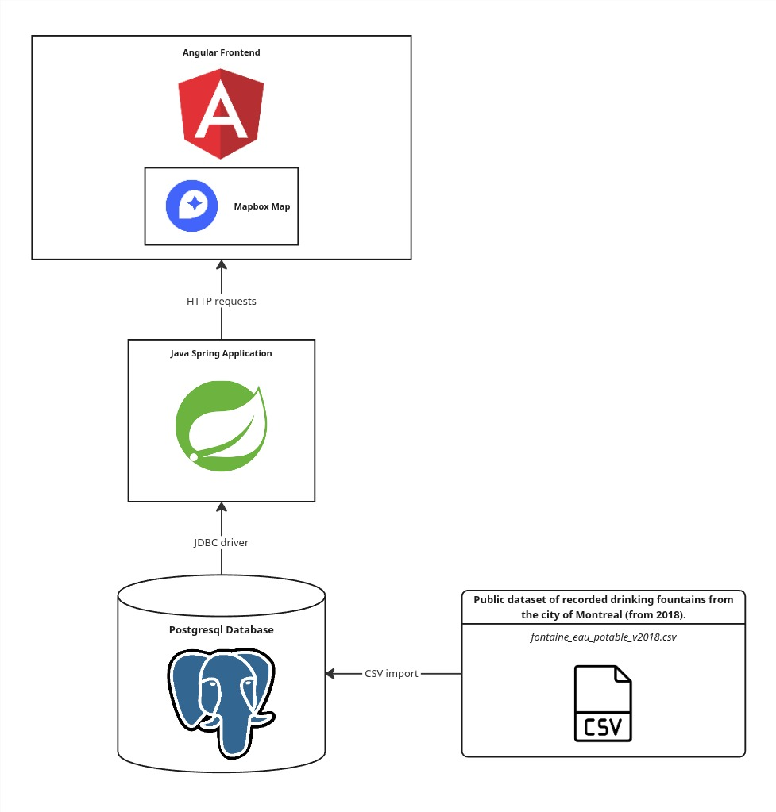

# J'ai Soif Montreal
_A website that displays an interactive map of public drinking fountains on the island of Montreal, Canada._

## Architecture

I chose to build this application using a very corporate tech stack. Java Spring has been a popular backend web framework and scales very well which is why it's often used in a corporate setting. I chose to use a Postgresql database for my application instead of firebase or creating my own NoSQL database because SQL databases are popular in corporate settings and Postgresql is widely supported and open source. I chose to use Angular as the frontend framework as it is a popular corporate choice for applications due to its comrehensiveness.

## The Data

The data was taken taken from the [city of Montreal's Donees Ouverts site](https://donnees.montreal.ca/dataset/fontaines-a-boire-eau-exterieures). The data is simply downloadable as a .CSV file (frustratingly some other "public" datasets from the city of Montreal are not likely due to privacy reasons). 

The dataset contains the following columns that had uable data:
- borough
- nearby park or place
- type of place nearby
- intersection
- notes
- longitude
- lattitude

The first things I did was manually translate the dataset from french to english using search and replace features. My intention wass to handle french localization later. I then enabled the [PostGIS](https://postgis.net/) extension for my Postgresql database because I wanted to store longitude and lattitude in once column. This didn't end up being super necessary as the app doesn't make use of any built in functions to for example calculate distances between points. I then used the COPYT command to import the data from the CSV file into a temporary table and then a permanent one with some extra fluff to combine the longitude and lattitude into the PostGIS Point column.

## The Backend

The backend is uper simple. Ultimately, the only API request I need to serve in the final application is one that returns data for all fountains in the system. Setting up requests to delete or insert records from the database is superflous. Even though, I eventually want to implement a form that allows users to submit fountains that will then only enter the database when I physically verify the existence of the water fountain in real life.

The key components of the application are:
- FountainResource (RestController)
- FountainService (Service)
- FountainRepo (implements JpaRepository)
- Fountain (Entity)

So the Fountain class is a Spring Entity that has fields analagous to the table schema in my Postgres database. [Hibernate](https://docs.spring.io/spring-framework/reference/data-access/orm/hibernate.html) (a module of Spring) then handles the reading of my table and the mapping of them to objects of this class. The FountainRepo then implements a function findAll() that is called and reutnre by a function i created in the FountainService class which is in turn called by the FountainResource. That's pretty much it.

## Isues with point

## How I handled localization

Montreal est une ville 
